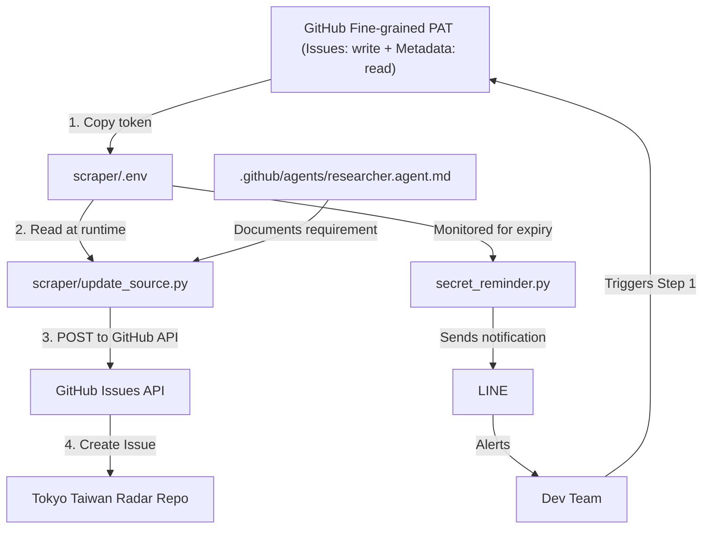

# GitHub Token (PAT) Rotation — Sync Checklist

> **Critical**: When rotating GITHUB_TOKEN (PAT expiry or security rotation), all three locations below must be updated simultaneously to prevent sync issues.

## 📍 Token Dependency Inventory

### Location 1: Runtime Token Value
- **File**: `scraper/.env`
- **Line**: 11
- **Format**: `GITHUB_TOKEN=github_pat_xxx`
- **Purpose**: Loaded by Python scrapers at runtime via `python-dotenv`
- **Who reads it**: `scraper/update_source.py` (when `--create-issue` flag used)
- **When updated**: During PAT rotation or expiry
- **Example**:
  ```env
  GITHUB_TOKEN=github_pat_REPLACE_WITH_YOUR_TOKEN
  ```

### Location 2: Source Code — Token Reader
- **File**: `scraper/update_source.py`
- **Lines**: 106, 109, 217
- **Purpose**: Reads GITHUB_TOKEN env var and creates GitHub Issues for researched sources
- **Function**: `create_github_issue(name: str, url: str, profile_path: Path | None) -> str`
- **When used**: `python scraper/update_source.py --url <url> --status researched --create-issue`
- **Error handling**: Raises RuntimeError if GITHUB_TOKEN not set or invalid
- **Example code**:
  ```python
  token = os.environ.get("GITHUB_TOKEN")
  if not token:
      raise RuntimeError(
          "GITHUB_TOKEN env var required for --create-issue. "
          "Set a classic token with 'repo' scope or a fine-grained token with Issues: write and Metadata: read."
      )
  headers = {
      "Authorization": f"Bearer {token}",
      "Accept": "application/vnd.github+json",
      "X-GitHub-Api-Version": "2022-11-28",
  }
  ```

### Location 3: Documentation & Agent Instructions
- **File**: `.github/agents/researcher.agent.md`
- **Lines**: 93–99
- **Purpose**: Documents GITHUB_TOKEN requirement for Researcher agent
- **Context**: Step 3 of "Add new research source" workflow — when marking source as "researched" with `--create-issue` flag
- **Content to verify**:
  ```markdown
  `--create-issue` requires `GITHUB_TOKEN` in `scraper/.env` 
  (classic token with `repo` scope or fine-grained with Issues: write + Metadata: read).
  ```

### Location 4: Secret Monitoring (Passive)
- **File**: `scraper/secret_reminder.py`
- **Purpose**: Sends LINE notification of secrets due for 90-day rotation
- **Mechanism**: Calls `load_dotenv()` to read `scraper/.env` and checks expiry metadata
- **Update needed?**: No — this is passive monitoring only. No hardcoded values here.
- **Note**: GitHub token appears in LINE notification message body automatically when rotation schedule is due.

### Location 5: e-Stat API Application ID (`ESTAT_APP_ID`)
- **File**: `scraper/.env`
- **Format**: `ESTAT_APP_ID=<32-char hex string>`
- **Purpose**: Authenticates e-Stat API calls (`getStatsList`, `getStatsData`, `getMetaInfo`)
- **Who reads it**: `scraper/external_stats/estat_population.py`, `scraper/external_stats/pull_all.py`
- **When obtained**: Register free account at [https://www.e-stat.go.jp/api/](https://www.e-stat.go.jp/api/) → Application Management → Register new app
- **Rotation**: **No expiry** — but revoke and re-register if leaked
- **CI secret**: Add `ESTAT_APP_ID` to GitHub Actions secrets (`Settings → Secrets and variables → Actions`)
- **Workflow that uses it**: `.github/workflows/external-stats-pull.yml`
- **Note**: e-Stat appId is not a rotating secret — no 90-day rotation required. Monitor only if leaked.

---

## 🔄 Token Rotation Workflow

### Prerequisites
- [ ] Fine-grained PAT with **Issues: write + Metadata: read** permissions (for `--create-issue` flag)
  - Alternative: Classic token with **repo** scope (broader, not recommended for new tokens)
- [ ] Token expiry date: **1 year recommended** (GitHub max: 1 year)
- [ ] Rotation frequency: **Every 90 days** (enforced by `secret_reminder.py` cron)

### Step 1: Generate New Token on GitHub
1. Go to **Settings → Developer settings → Personal access tokens → Fine-grained tokens**
2. Click **Generate new token**
3. **Token name**: `Tokyo Taiwan Radar Scraper PAT` (or similar)
4. **Expiration**: 90 days (aligned with rotation cycle)
5. **Resource owner**: Select `TuiTuiKoan/Tokyo_Taiwan_Radar` repo
6. **Repository permissions**:
   - ✅ Issues: **write**
   - ✅ Metadata: **read** (automatically included)
7. Click **Generate token**
8. **Copy the token immediately** — GitHub only shows it once

### Step 2: Update `scraper/.env`
```bash
# Edit scraper/.env
GITHUB_TOKEN=github_pat_<NEW_TOKEN_VALUE>
```
- Verify file is **NOT committed to git** (check `.gitignore` contains `scraper/.env`)
- Test locally:
  ```bash
  cd scraper
  source venv/bin/activate
  python update_source.py --url "https://example.com/event" --status researched --create-issue
  ```
- Expected: GitHub Issue created successfully with no auth errors

### Step 3: Verify Documentation is Current
- Open `.github/agents/researcher.agent.md`
- Verify line 99 still says:
  ```
  `--create-issue` requires `GITHUB_TOKEN` in `scraper/.env` (classic token with `repo` scope or fine-grained with Issues: write + Metadata: read).
  ```
- If changed: Update to match current token type and permissions
- **No commit needed** for documentation (it's already in version control)

### Step 4: Verification Checklist
Run these checks to confirm token is working:

```bash
# 1. Verify env var is set (masked — never prints the token value)
cd scraper && awk -F= '/^GITHUB_TOKEN=/{print "GITHUB_TOKEN present, len="length($2)", prefix_ok="(($2 ~ /^github_pat_/)?"yes":"no")}' .env

# 2. Test token locally (if you have a research source URL)
source venv/bin/activate
python update_source.py --url "https://example.com" --status researched --create-issue
# Expected: GitHub Issue created, URL printed to console

# 3. Confirm token is fine-grained (optional) — check GitHub Personal Access Token page
# - Token name should show "Tokyo Taiwan Radar Scraper PAT" or similar
# - Expiration date should be ~90 days from today
```

### Step 5: Monitor Expiry
- GitHub sends email reminder **7 days before** expiry
- `secret_reminder.py` (cron every 90 days) sends LINE notification with ALL expiring secrets
  - File: `.github/workflows/secret-rotation-reminder.yml`
  - Schedule: Line 5 — `cron: '0 9 * * 0'` (Sundays 9:00 JST)
  - **Action**: Receives LINE notification → Plan rotation above

---

## ⚠️ Sync Violation Scenarios

### Scenario A: Token in `.env` is valid, but source code error message is outdated
- **Risk**: Low — only affects documentation/error messages, token still works
- **Fix**: Update `.github/agents/researcher.agent.md` line 99 with new token type/scope

### Scenario B: Token in `.env` is expired, `--create-issue` fails silently
- **Risk**: High — researchers mark sources as "researched" but GitHub Issue not created
- **Detection**: Run `python scraper/update_source.py --url ... --create-issue` and check for 401/403 error
- **Fix**: Rotate token immediately (steps above), update `.env`

### Scenario C: `scraper/.env` accidentally committed to git
- **Risk**: Critical — token exposed in public repo history
- **Fix**:
  1. Revoke token immediately on GitHub Personal Access Token page
  2. Create new token (steps above)
  3. Update `.env` with new token
  4. Use `git filter-branch` or `git-filter-repo` to purge from history (consult GitHub Docs)

---

## 📊 Dependency Graph



---

## 🛠️ Support & Troubleshooting

### Error: `GITHUB_TOKEN env var required for --create-issue`
- **Cause**: `.env` file missing or `GITHUB_TOKEN` key not set
- **Fix**: 
  ```bash
  cd scraper
  # masked — confirms presence/length/prefix without printing the token
  awk -F= '/^GITHUB_TOKEN=/{print "GITHUB_TOKEN present, len="length($2)", prefix_ok="(($2 ~ /^github_pat_/)?"yes":"no")}' .env
  # If it prints nothing, the key is missing — follow Step 1 and Step 2 above
  ```

### Error: `GitHub API error 401` or `401: Bad credentials`
- **Cause**: Token expired or invalid
- **Fix**: Follow token rotation steps (Step 1–5 above)

### Error: `GitHub API error 403: Resource not accessible by integration`
- **Cause**: Token missing **Issues: write** or **Metadata: read** permission
- **Fix**: Generate new fine-grained token with correct permissions (Step 1 above)

### Question: Can I use the same PAT for both local development and CI/CD?
- **Answer**: 
  - **CI/CD workflows**: Do NOT use `GITHUB_TOKEN` explicitly (use `secrets.GITHUB_TOKEN` provided by GitHub Actions)
  - **Local development**: Use `.env` with fine-grained PAT (current setup)
  - **Separation**: This is intentional — PAT is local-only, not exposed in GitHub Actions

### Question: What if I lose the PAT value before updating all locations?
- **Answer**: If you copied the new token but haven't updated `.env` yet, GitHub still shows it on the Personal Access Token page (one time). If lost:
  1. Go to GitHub Settings → Developer settings → Personal access tokens
  2. Revoke the old token
  3. Create a new one (Step 1 above)

---

## 📅 Rotation Schedule

| Item | Frequency | Due Date | Who | Method |
|------|-----------|----------|-----|--------|
| GITHUB_TOKEN rotation | Every 90 days | `today() + 90d` | On-call dev | Email reminder (7 days before) → Manual rotation steps |
| secret_reminder.py notification | Every 90 days | Sundays 9:00 JST | Team (via LINE) | Cron job `.github/workflows/secret-rotation-reminder.yml` |
| `.github/agents/researcher.agent.md` verification | Per rotation | Same as rotation | During Step 3 | Manual review + update if needed |

---

## ✅ Checklist for Token Rotation

- [ ] Step 1: Generate new fine-grained PAT on GitHub (Issues: write + Metadata: read, 90-day expiry)
- [ ] Step 2: Update `scraper/.env` with new token value
- [ ] Step 3: Verify `.github/agents/researcher.agent.md` line 99 is current
- [ ] Step 4: Test locally: `python scraper/update_source.py --url ... --status researched --create-issue`
- [ ] Step 5: Confirm GitHub Issue was created (if test source provided)
- [ ] Add calendar reminder: Next rotation in 90 days
- [ ] (Optional) Commit confirmation: No changes to `.env` in git history ✓

---

**Last updated**: 2026-05-01  
**Maintained by**: Architecture team  
**Related files**: `scraper/.env`, `scraper/update_source.py`, `.github/agents/researcher.agent.md`
